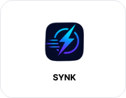
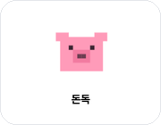
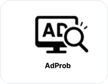
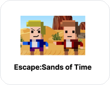

<h1 align="center">권유현 | YouHyun</h1>

  <b>신뢰할 수 있는 서비스를 만드는 백엔드 개발자</b>

  AI를 활용해 개발 속도를 높이고, 
  백엔드 구조와 데이터 흐름으로 서비스의 신뢰를 설계합니다.

  
  
  

  
  
  

---

## 👋 About Me

- 🎓 호서대학교 컴퓨터공학부 졸업
- 🌱 현재 **KB IT’s Your Life 7기**에서 실무형 웹 개발 역량을 키우고 있습니다.
- 🔧 **Spring Boot, Flask, PostgreSQL, MySQL, AWS** 기반 백엔드 개발에 관심이 많습니다.
- 🤖 **Claude Code, OpenAI Codex, ChatGPT, Gemini**를 활용해 개발 생산성을 높이는 방법을 탐구하고 있습니다.
- 🚀 현재 **SYNK**와 **돈독** 프로젝트를 진행하며 서비스 기획부터 구현, 배포까지 경험하고 있습니다.
- ✍️ 학습 과정과 프로젝트 회고는 [Tistory Blog](https://youhyun-hi.tistory.com/)에 기록하고 있습니다.

---

## 🔍 Current Focus

  
  
  
  
  
  

> 부족함을 숨기기보다 인정하고, 필요한 역량을 끝까지 채워가는 개발자가 되고 싶습니다.

---

## 🛠 Tech Stack

### Languages

  
  
  
  
  

### Back-end

  
  
  
  
  
  

### Database & Infra

  
  
  
  
  
  
  

### Front-end

  
  
  

### AI-assisted Development

  
  
  
  
  
  

### Tools

  
  
  
  
  
  
  

---

## 📚 My Projects

<table>
  <tr>
    <td width="180" align="center">
      
    </td>
    <td>
      <h3>SYNK · 실시간 동기화 미션 서비스</h3>
      
<b>Role:</b> Back-end Developer

      
<b>About Project:</b> 친구들이 같은 시간에 미션을 수행하고, 제출한 영상을 콜라주로 공유하는 앱 출시 목표 서비스

      
<b>Stack:</b> Spring Boot, PostgreSQL, Supabase, WebSocket, AWS Lambda, AWS S3, Docker, FFmpeg

      

        <a href="https://github.com/youhyun010615/SYNK-back">github</a>
        |
        <a href="https://synk-front.vercel.app/">service</a>
      

    </td>
  </tr>

  <tr>
    <td width="180" align="center">
      
    </td>
    <td>
      <h3>돈독 · 게이미피케이션 소비 관리 서비스</h3>
      
<b>Role:</b> 기획 및 개발

      
<b>About Project:</b> 소비 상태를 돼지·집·감독관 캐릭터 변화로 시각화해 절약 동기를 유도하는 가계부 서비스

      
<b>Stack:</b> Vue 3, Pinia, Axios, JSON Server, Vercel, Railway, Spring Boot

      

        <a href="https://github.com/youhyun010615/dondocV2">github</a>
        |
        <a href="https://github.com/youhyun010615/dondocV2-backend">backend</a>
        |
        <a href="https://don-doc-mu.vercel.app/">service</a>
      

    </td>
  </tr>

  <tr>
    <td width="180" align="center">
      
    </td>
    <td>
      <h3>AdProb · 머신러닝 기반 블로그 광고 탐지 시스템</h3>
      
<b>Role:</b> Team Leader / ML & Server

      
<b>About Project:</b> 블로그 리뷰의 광고 여부를 텍스트·이미지 데이터 기반으로 분석하는 광고 탐지 시스템

      
<b>Stack:</b> Python, Flask, JavaScript, CatBoost, LSTM AutoEncoder, OCR, GPT API, Pandas

      

        <a href="https://github.com/youhyun010615/Adprob">github</a>
        |
        정확도 65% → 89%, 재현율 약 20%p 향상
      

    </td>
  </tr>

  <tr>
    <td width="180" align="center">
      
    </td>
    <td>
      <h3>AutoMailer · 이메일 자동화 프로그램</h3>
      
<b>Role:</b> Python Automation Developer

      
<b>About Project:</b> 행사 신청 메일 확인, 명단 정리, 합격·불합격 안내 발송을 자동화한 프로그램

      
<b>Stack:</b> Python, IMAP, SMTP, OpenPyXL

      

        <a href="https://github.com/youhyun010615/AutoMailer">github</a>
        |
        교내 Python 프로그램 개발 대회 최우수상
      

    </td>
  </tr>

  <tr>
    <td width="180" align="center">
      
    </td>
    <td>
      <h3>Escape:Sands of Time · 웹 기반 탈출 게임</h3>
      
<b>Role:</b> Front-end Developer

      
<b>About Project:</b> HTML, CSS, JavaScript를 활용해 제작한 웹 기반 탈출 게임 프로젝트

      
<b>Stack:</b> HTML, CSS, JavaScript

      

        <a href="https://github.com/youhyun010615/sandofwebgame">github</a>
      

    </td>
  </tr>
</table>

---

## 🏃 Activities & Growth

### KB IT’s Your Life 7기

- `2026.03 ~ 2026.08`
- Java, Spring Boot, Vue.js, MySQL, Git/GitHub 기반 웹 개발 학습
- 팀 프로젝트 및 실무형 프로젝트 진행
- 기자단 활동을 통해 학습 내용과 프로젝트 경험 기록

### 학술동아리 컴바라기 회장단

- `2023.08 ~ 2024.08`
- 세미나 운영, 멘토·멘티 프로그램 기획 및 운영
- 세미나 참여율 30% 이상 증가
- 다음 학기 지원율 40% 증가

### 유학생 버디 프로그램

- `2025.03 ~ 2025.06`
- 약 10주, 총 30시간 동안 유학생 학교생활 및 문화 적응 지원

---

## 🏆 Awards & Certifications

  
  
  
  
  

---

## 📊 GitHub Stats

  

  

---

## 📫 Contact

  
  
  

---

  <b>기술을 빠르게 익히는 것보다, 끝까지 이해하고 서비스로 완성하는 개발자가 되고 싶습니다.</b>

